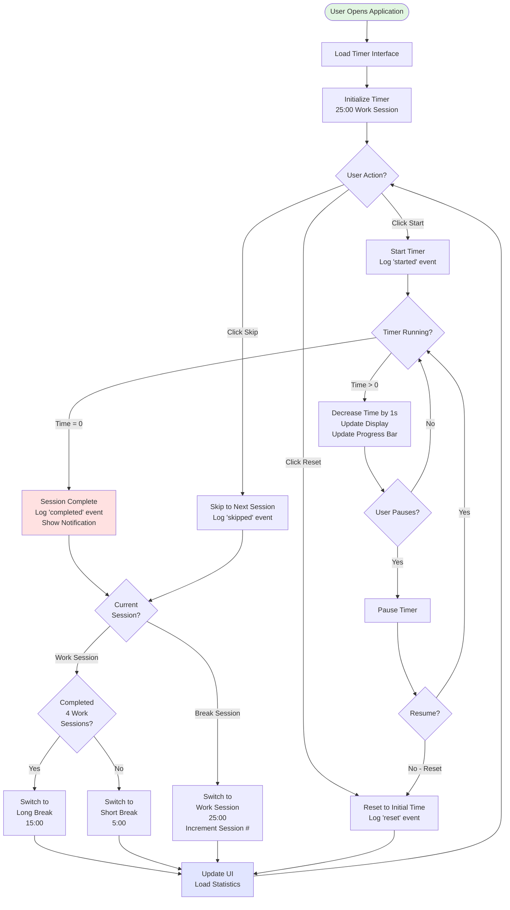
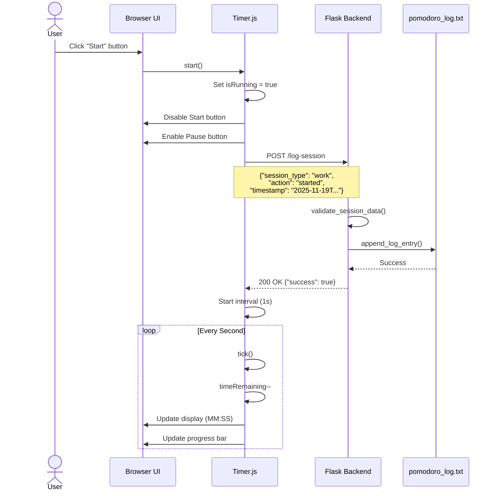
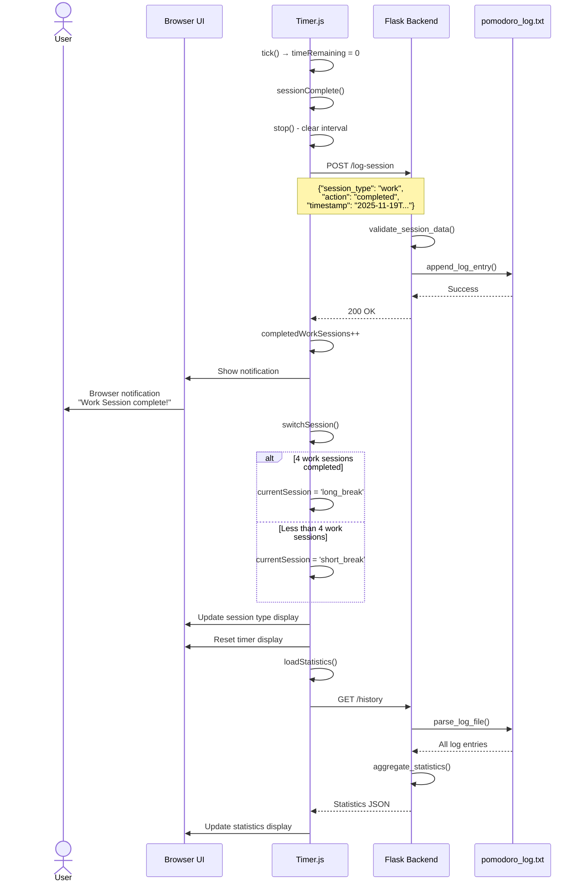
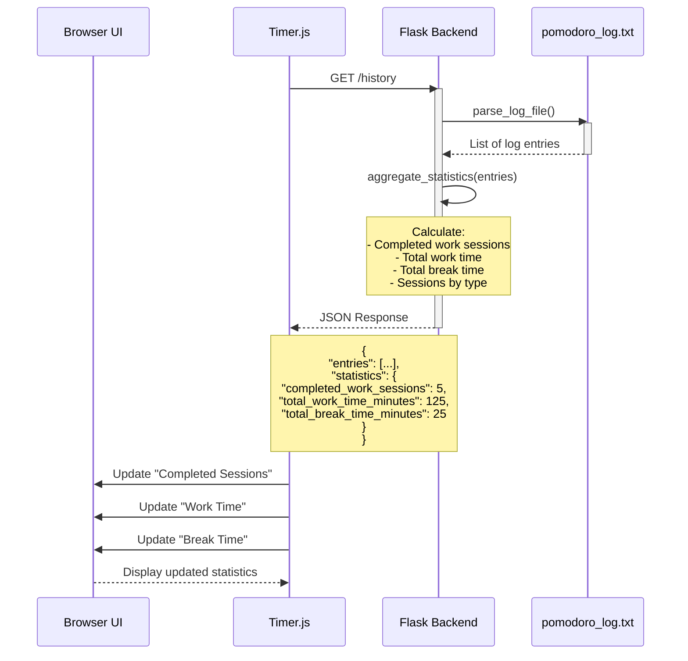
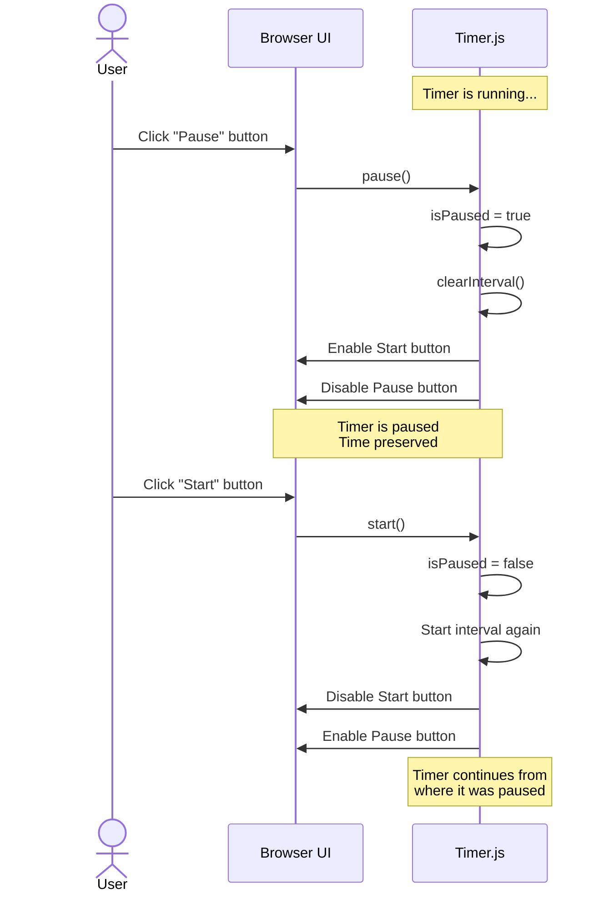
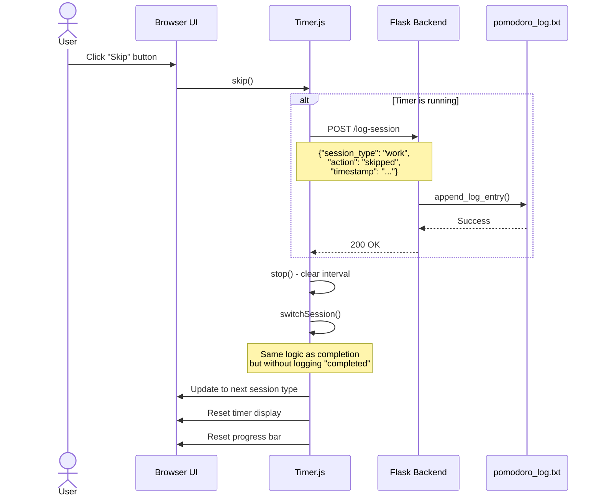
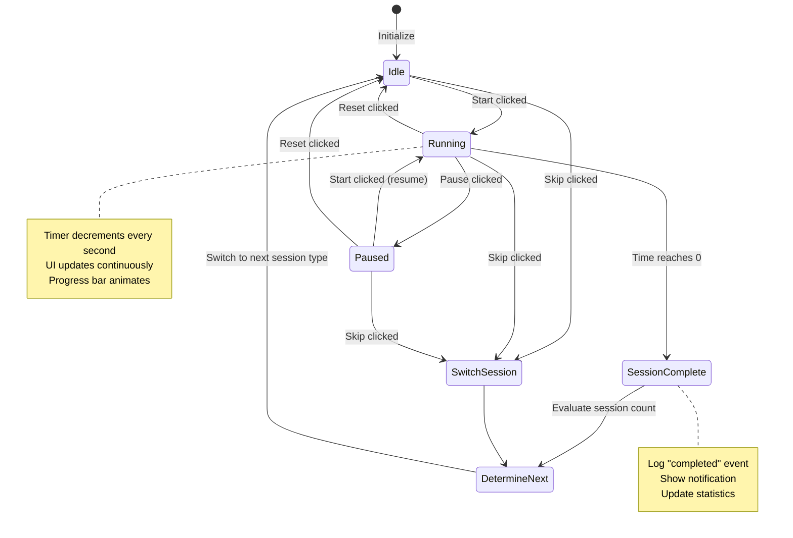

# Pomodoro Timer Application Documentation

## Overview

The Pomodoro Timer is a web-based productivity application that implements the Pomodoro Technique - a time management method that uses a timer to break work into focused intervals (typically 25 minutes) separated by short breaks.

## Architecture

### Technology Stack

- **Backend**: Flask (Python)
- **Frontend**: Vanilla JavaScript (ES6+)
- **Styling**: CSS3
- **Data Storage**: Text file (JSON logs)
- **Communication**: RESTful API

### Application Structure

```
pomodoro_app/
├── app.py                 # Flask backend server
├── pomodoro_log.txt       # Session logs storage
├── static/
│   ├── style.css         # Application styling
│   └── timer.js          # Frontend timer logic
└── templates/
    └── index.html        # Main HTML page
```

## How It Works

### Core Functionality

#### 1. Timer Management

The application manages three types of timed sessions:
- **Work Session**: 25 minutes of focused work
- **Short Break**: 5 minutes of rest
- **Long Break**: 15 minutes of rest (after every 4 work sessions)

#### 2. Session Flow

The timer follows the classic Pomodoro Technique pattern:
1. Start with a Work Session
2. After completion, take a Short Break
3. Return to Work Session
4. After 4 completed work sessions, take a Long Break
5. Repeat the cycle

#### 3. User Controls

- **Start**: Begin or resume the current session
- **Pause**: Temporarily pause the running timer
- **Reset**: Reset the current session to its initial duration
- **Skip**: Skip to the next session type

#### 4. Session Logging

Every significant event is logged to `pomodoro_log.txt`:
- Session started
- Session completed
- Session skipped
- Session reset

Each log entry contains:
- `session_type`: work, short_break, or long_break
- `action`: started, completed, skipped, or reset
- `timestamp`: ISO 8601 formatted timestamp

#### 5. Statistics Tracking

The application tracks and displays:
- Total completed work sessions
- Total work time (in minutes)
- Total break time (in minutes)

## User Flow Diagram



## Sequence Diagrams

### Starting a Work Session



### Completing a Session



### Loading Statistics



### User Pauses and Resumes



### Skipping a Session



## API Endpoints

### POST `/log-session`

Logs a session event to the log file.

**Request Body:**
```json
{
  "session_type": "work|short_break|long_break",
  "action": "started|completed|skipped|reset",
  "timestamp": "2025-11-19T10:30:00.000Z"
}
```

**Response:**
```json
{
  "success": true,
  "message": "Session logged successfully"
}
```

**Error Response:**
```json
{
  "error": "Invalid session_type. Must be one of: ['work', 'short_break', 'long_break']"
}
```

### GET `/history`

Retrieves all session history and aggregated statistics.

**Response:**
```json
{
  "entries": [
    {
      "session_type": "work",
      "action": "completed",
      "timestamp": "2025-11-19T10:30:00.000Z"
    }
  ],
  "statistics": {
    "total_sessions": 5,
    "completed_work_sessions": 5,
    "completed_break_sessions": 4,
    "skipped_sessions": 0,
    "total_work_time_minutes": 125,
    "total_break_time_minutes": 25,
    "by_type": {
      "work": {"started": 5, "completed": 5, "skipped": 0},
      "short_break": {"started": 4, "completed": 4, "skipped": 0},
      "long_break": {"started": 0, "completed": 0, "skipped": 0}
    }
  },
  "total_entries": 14
}
```

### GET `/`

Serves the main HTML page with the timer interface.

## Key Frontend Classes and Methods

### Timer Class (`timer.js`)

#### Properties
- `durations`: Object containing session durations in seconds
- `currentSession`: Current session type (work/short_break/long_break)
- `timeRemaining`: Seconds remaining in current session
- `isRunning`: Boolean indicating if timer is active
- `isPaused`: Boolean indicating if timer is paused
- `completedWorkSessions`: Counter for completed work sessions
- `sessionCount`: Current session number

#### Methods

**Control Methods:**
- `start()`: Start or resume the timer
- `pause()`: Pause the running timer
- `reset()`: Reset the current session
- `skip()`: Skip to the next session

**Core Logic:**
- `tick()`: Decrements time and updates UI (called every second)
- `sessionComplete()`: Handles session completion
- `switchSession()`: Determines and switches to next session type

**UI Updates:**
- `updateDisplay()`: Updates the timer display (MM:SS)
- `updateProgress()`: Updates the progress bar
- `updateSessionInfo()`: Updates session type and count displays

**Backend Communication:**
- `logSessionEvent()`: Sends session events to backend
- `loadStatistics()`: Fetches and displays statistics

**Notifications:**
- `notify()`: Shows browser notifications and visual feedback

## Key Backend Functions

### Validation
- `validate_session_data(data)`: Validates incoming session data

### Logging
- `format_log_entry(data)`: Formats session data as JSON
- `append_log_entry(data)`: Writes log entry to file
- `parse_log_file()`: Reads and parses all log entries

### Statistics
- `aggregate_statistics(entries)`: Calculates statistics from log entries

### Routes
- `index()`: Serves the main page
- `log_session()`: Handles session logging
- `history()`: Returns session history and statistics

## Data Flow

1. **User Interaction** → Browser UI captures button clicks
2. **Frontend Logic** → Timer class manages state and logic
3. **API Communication** → Async fetch calls to Flask backend
4. **Data Persistence** → Flask writes to text file (JSON lines)
5. **Statistics** → Backend aggregates data from log file
6. **Display Update** → Frontend updates UI with latest data

## Session State Machine



## Features

### ✅ Implemented Features

1. **Timer Functionality**
   - Configurable work/break durations
   - Start, pause, reset, and skip controls
   - Automatic session switching
   - Visual progress bar

2. **Session Management**
   - Tracks work sessions
   - Alternates between short and long breaks
   - Long break after every 4 work sessions

3. **Logging & Persistence**
   - All session events logged with timestamps
   - JSON-formatted log file
   - Historical data preserved

4. **Statistics**
   - Real-time statistics display
   - Completed sessions counter
   - Total work and break time tracking
   - Detailed breakdown by session type

5. **User Experience**
   - Browser notifications
   - Visual feedback for session completion
   - Dynamic document title updates
   - Responsive design

### 🔄 Session Type Logic

```javascript
// After work session:
if (completedWorkSessions % 4 === 0) {
    nextSession = 'long_break'  // Every 4th work session
} else {
    nextSession = 'short_break'
}

// After any break:
nextSession = 'work'
sessionCount++
```

## Running the Application

### Prerequisites
- Python 3.7+
- Flask installed (`pip install flask`)

### Start the Server
```bash
python pomodoro_app/app.py
```

The application will be available at `http://localhost:5000`

### Configuration
Default durations are set in `timer.js`:
```javascript
this.durations = {
    work: 25 * 60,         // 25 minutes
    short_break: 5 * 60,   // 5 minutes
    long_break: 15 * 60    // 15 minutes
};
```

## File Structure Details

### `pomodoro_log.txt`
Each line contains a JSON object:
```json
{"session_type": "work", "action": "started", "timestamp": "2025-11-19T10:00:00.000Z"}
{"session_type": "work", "action": "completed", "timestamp": "2025-11-19T10:25:00.000Z"}
{"session_type": "short_break", "action": "started", "timestamp": "2025-11-19T10:25:00.000Z"}
```

## Browser Compatibility

- Modern browsers with ES6+ support
- Notification API support (Chrome, Firefox, Edge, Safari)
- Fetch API support (all modern browsers)

## Error Handling

### Frontend
- Failed API calls are logged to console
- Statistics load failures are handled gracefully
- Timer continues to work even if logging fails

### Backend
- Input validation on all endpoints
- Malformed JSON entries are skipped when parsing
- File I/O errors are caught and logged
- Proper HTTP status codes returned

## Future Enhancement Ideas

- User authentication
- Customizable session durations
- Task/project association with sessions
- Charts and analytics
- Sound customization
- Dark mode toggle
- Export statistics to CSV
- Mobile app version
- Keyboard shortcuts

---

**Last Updated**: November 19, 2025
**Version**: 1.0
